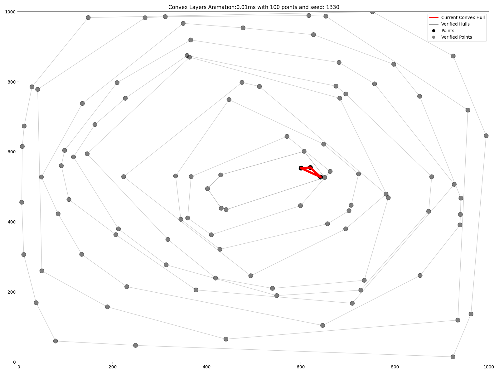

# QuickHull_Convex_Layers_Animation

Great! You can include the photos in your `README.md` to provide visual examples of the project's output. Here's how you can integrate them:

---

# Convex Hull Layers Animation

This project visualizes the computation of convex hull layers from a set of random points in 2D space. Using a custom QuickHull implementation, the project iteratively computes and animates the removal of convex layers, revealing the nested structure of the point set.

## Features

- **Convex Hull Computation:** Implements the QuickHull algorithm to compute the convex hull of a set of points.
- **Layered Visualization:** Displays multiple layers of convex hulls iteratively, fading out verified layers.
- **Animation:** Smooth, interactive animation using Matplotlib.
- **Customization:** Easily configurable parameters for number of points, animation speed, colors, and more.

## Example Output

Here are snapshots of the animation at various stages with different point densities:

| 50 Points             | 100 Points             | 1000 Points            |
|-------------------------|------------------------|------------------------|
|  |  |  |

| 5000 Points            | 10000 Points           |
|------------------------|------------------------|
|  |  |

Each image demonstrates how the convex hull layers evolve as the number of points increases. 

## Installation

1. Clone the repository:
   ```bash
   git clone https://github.com/ml3m/QuickHull_Convex_Layers_Animation.git
   cd QuickHull_Convex_Layers_Animation
   ```

2. Install dependencies:
   ```bash
   pip install -r requirements.txt
   ```

## Usage

Run the main script:
```bash
python main.py
```

The animation will display a series of convex hull layers computed from the random points. Points from verified layers will gradually fade out as the animation progresses.

## Configuration

Customize the behavior of the animation by editing `config.py`:
- **RANDOM_SEED**: Set the seed for reproducibility.
- **NUMBER_POINTS**: Number of random points to generate.
- **POINTS_RANGE**: Range of coordinates for the points.
- **X_LIM, Y_LIM**: Limits of the plot.
- **X_WINDOW, Y_WINDOW**: Window size of the Matplotlib figure.
- **ANIMATION_INTERVAL_MS**: Frame interval for the animation.
- **Colors and Sizes**: Adjust colors and sizes for points, lines, and hulls.

## QuickHull Implementation

The convex hull computation is based on the QuickHull algorithm, implemented in `convexhull_quickhull_implementation.py`. Key features:
- Efficient recursive approach to find hull points.
- Handles degenerate cases with fewer than three points.
- Computes additional properties such as area and simplices.
